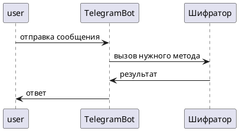

# Telegram-бот для кодирования и декодирования сообщений

## Проект в рамках практики: "Собственная реализация технологий шифрования и сжатия"

---

## Оглавление

1. [Описание проекта](#описание-проекта)
2. [Выбранные технологии](#выбранные-технологии)
3. [Последовательность исследования](#последовательность-исследования)
4. [Техническое руководство](#техническое-руководство)

   * [1. Подготовка окружения](#1-подготовка-окружения)
   * [2. Реализация алгоритмов](#2-реализация-алгоритмов)
   * [3. Интеграция с Telegram API](#3-интеграция-с-telegram-api)
5. [Схемы и диаграммы](#схемы-и-диаграммы)
6. [Модификация проекта](#модификация-проекта)
7. [Финальный отчёт](#финальный-отчёт)

---

## Описание проекта

Проект представляет собой Telegram-бота, позволяющего пользователю кодировать и декодировать текст с помощью следующих алгоритмов:

* Шифр Цезаря (Caesar cipher)
* Код Шеннона–Фано (Shannon–Fano encoding)
* Код Хэмминга (Hamming code)
* Декодирование соответствующих кодов

---

## &#x20;Выбранные технологии

| Технология          | Назначение                        |
| ------------------- | --------------------------------- |
| Python              | Язык программирования             |
| python-telegram-bot | Telegram API                      |
| Markdown            | Документация                      |
| PlantUML            | UML-диаграммы                     |
| Git + GitHub        | Репозиторий и управление версиями |

---

## Последовательность исследования

1. Исследование алгоритмов: Цезарь, Шеннон–Фано, Хэмминг
2. Поиск подходящих реализаций и адаптация под Python
3. Изучение Telegram API и создание бота
4. Разработка пошагового взаимодействия с пользователем
5. Тестирование на различных вводах
6. Модификация кода: добавление логирования и обработки ошибок

---

## Техническое руководство

### 1. Подготовка окружения

```bash
pip install python-telegram-bot
```

Создай файл `.env` с токеном:

```
TELEGRAM_TOKEN=your_token_here
```

### 2. Реализация алгоритмов

#### Шифр Цезаря

```python
def caesar_encrypt(text, shift):
    result = ""
    for char in text:
        if char.isalpha():
            base = ord('A') if char.isupper() else ord('a')
            result += chr((ord(char) - base + shift) % 26 + base)
        else:
            result += char
    return result
```

#### Шеннон–Фано

(Упрощённый пример: частоты символов и рекурсивное разбиение)

```python
def shannon_fano_encode(symbols):
    if len(symbols) <= 1:
        return {k: '0' for k in symbols}
    sorted_symbols = sorted(symbols.items(), key=lambda x: -x[1])
    # Реализация деления на две группы и рекурсия...
```

#### Хэмминг (7,4)

```python
def hamming_encode(data):
    # data = 4 bits
    d = list(map(int, data))
    p1 = d[0] ^ d[1] ^ d[3]
    p2 = d[0] ^ d[2] ^ d[3]
    p3 = d[1] ^ d[2] ^ d[3]
    return f"{p1}{p2}{d[0]}{p3}{d[1]}{d[2]}{d[3]}"
```

### 3. Интеграция с Telegram API

```python
from telegram.ext import Updater, CommandHandler, MessageHandler, Filters

def start(update, context):
    update.message.reply_text("Привет! Отправь текст и выбери метод кодирования.")

def handle_message(update, context):
    # логика выбора метода и вызова нужной функции
    ...

updater = Updater("YOUR_TOKEN")
dp = updater.dispatcher
dp.add_handler(CommandHandler("start", start))
dp.add_handler(MessageHandler(Filters.text, handle_message))

updater.start_polling()
```

---

## 🗀 Схемы и диаграммы

### 1. Общая архитектура бота



### 2. ⟳ Алгоритм Хэмминга

```
[Start] --> [Input 4-битные данные]
--> [Вычисление контрольных битов]
--> [Сборка 7-битного кода]
--> [Output]
```

### 3. Use Case диаграмма

* Пользователь

  * /start
  * Ввод текста
  * Выбор метода (кнопки)
  * Получение результата

### 4. Пример работы

**Ввод:** `hello`
**Метод:** Цезарь, сдвиг 3
**Результат:** `khoor`

---

## Модификация проекта

### Новая функция: автоматическое определение типа кодировки по префиксу

Пример:

* `/caesar hello 3`
* `/hamming 1011`

### Автоматическая валидация входных данных

* Проверка длины входа для Хэмминга
* Предупреждения при некорректном формате

### Добавлено логирование:

```python
import logging
logging.basicConfig(level=logging.INFO)
```

---

## Финальный отчёт

### Этапы работы

| Этап | Дата       | Описание                                    |
| ---- | ---------- | ------------------------------------------- |
| 1    | 10.04.2025 | Выбор темы и стеков                         |
| 2    | 12.04.2025 | Изучение алгоритмов                         |
| 3    | 15.04.2025 | Создание Telegram-бота                      |
| 4    | 18.04.2025 | Тестирование                                |
| 5    | 20.04.2025 | Модификация                                 |
| 6    | 25.04.2025 | Подготовка документации и финального отчета |


### Индивидуальный план

| Участник   | Ответственность                                   |
| ---------- | ------------------------------------------------- |
| Мухамеддин | Реализация алгоритмов, Telegram-бот, документация |

---

## Заключение

Проект позволяет новичкам понять, как работают базовые алгоритмы кодирования и интеграция с Telegram API. Он служит примером того, как можно совместить теоретические знания с практикой.
